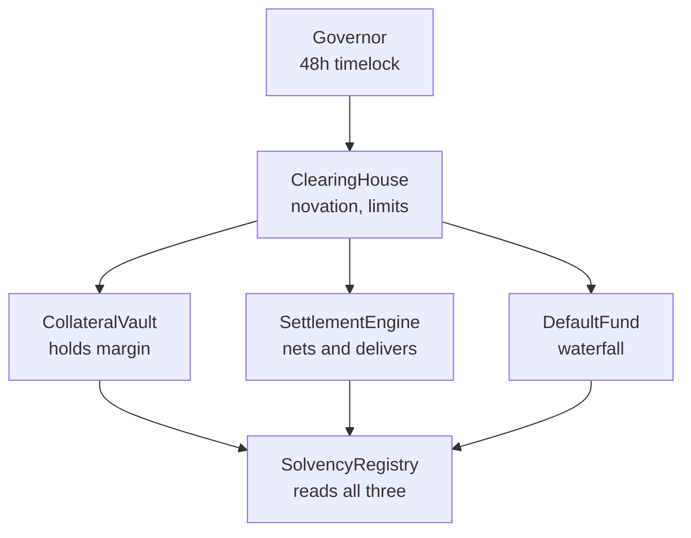

# Contracts

The onchain half. Everything above this page describes what the protocol does; this page is
what actually holds the money and what you can verify yourself.

Nothing here is deployed yet. The addresses below are placeholders in the shape they will
take, and the interfaces are the ones the implementation is being written against.

## Deployments

| Contract | Mainnet | Testnet |
| --- | --- | --- |
| `ClearingHouse` | `0x0000...0000` | `0x0000...0000` |
| `CollateralVault` | `0x0000...0000` | `0x0000...0000` |
| `SettlementEngine` | `0x0000...0000` | `0x0000...0000` |
| `DefaultFund` | `0x0000...0000` | `0x0000...0000` |
| `SolvencyRegistry` | `0x0000...0000` | `0x0000...0000` |
| `Governor` | `0x0000...0000` | `0x0000...0000` |

Chain ID `4663`. Settlement asset is USDC, address published with the deployment.

## How the pieces fit



`ClearingHouse` is the only contract a venue ever calls. The rest are called by it, and are
readable by anyone.

## ClearingHouse

```solidity
interface IClearingHouse {
    struct Fill {
        bytes32 fillId;
        address venue;
        address asset;
        address buyer;
        address seller;
        uint256 size;
        uint256 price;
        uint64  matchedAt;
    }

    /// @notice Discharges the bilateral trade and writes two obligations.
    /// @dev Reverts on limit breach before any state is written.
    function novate(Fill calldata fill, bytes calldata signature)
        external
        returns (bytes32 obligationId);

    function obligation(bytes32 obligationId)
        external
        view
        returns (address member, address asset, int256 cash, uint64 windowId, uint8 state);

    function positionOf(address member, address asset, uint64 windowId)
        external
        view
        returns (uint256 gross, int256 net, uint256 requiredMargin);

    function limitOf(address member) external view returns (uint256);
}
```

`novate` reverts rather than returning an error. The revert reasons map one to one onto the
codes in [Errors](errors.md), so `SPIRE-3001` surfaces as `LimitExceeded(member, limit,
attempted)`.

## CollateralVault

```solidity
interface ICollateralVault {
    function post(address member, address asset, uint256 amount) external;
    function withdraw(address member, address asset, uint256 amount) external;

    function haircutValue(address member) external view returns (uint256);
    function freeCollateral(address member) external view returns (int256);
    function haircutOf(address asset) external view returns (uint16 bps);
}
```

`freeCollateral` is signed on purpose. A negative return is a live margin call, not a
failure, and it is the value the cure period runs against.

## SettlementEngine

```solidity
interface ISettlementEngine {
    function currentWindow() external view returns (uint64);
    function finalise(uint64 windowId) external;
    function netOf(address member, address asset, uint64 windowId)
        external
        view
        returns (int256);
    function deliver(uint64 windowId, address asset) external;
}
```

`finalise` is permissionless and callable by anyone once `closesAt` has passed. A protocol
whose settlement depends on the operator running a job is a protocol with an operator-shaped
hole in it.

## DefaultFund

```solidity
interface IDefaultFund {
    function contributionOf(address member) external view returns (uint256);
    function assessmentCapOf(address member) external view returns (uint256);
    function insuranceBalance() external view returns (uint256);

    /// @notice Applies the five layers in order. Reverts if called out of order.
    function absorb(address defaulter, uint256 shortfall)
        external
        returns (uint256 fromMargin, uint256 fromOwnFund, uint256 fromInsurance, uint256 fromMutual);
}
```

The four return values exist so that the order of absorption is observable after the fact
rather than asserted. See [Default waterfall](default-waterfall.md).

## Events

| Event | Emitted by | Signature |
| --- | --- | --- |
| `Novated` | ClearingHouse | `(bytes32 obligationId, address member, address asset, uint64 windowId)` |
| `LimitExceeded` | ClearingHouse | `(address member, uint256 limit, uint256 attempted)` |
| `WindowFinalised` | SettlementEngine | `(uint64 windowId, uint32 obligationCount)` |
| `Settled` | SettlementEngine | `(uint64 windowId, address member, address asset, int256 net)` |
| `MarginCall` | CollateralVault | `(address member, uint256 shortfall, uint64 curesAt)` |
| `Defaulted` | DefaultFund | `(address member, uint64 windowId, uint256 shortfall)` |
| `Absorbed` | DefaultFund | `(address member, uint8 layer, uint256 amount)` |
| `ProofPublished` | SolvencyRegistry | `(uint64 windowId, bytes32 commitment)` |

`Absorbed` fires once per layer touched, so a default that stops at layer one emits one
event and a default that reaches the mutualised fund emits four.

## Signing a fill

EIP-712 domain:

```solidity
bytes32 constant DOMAIN = keccak256(abi.encode(
    keccak256("EIP712Domain(string name,string version,uint256 chainId,address verifyingContract)"),
    keccak256("Spire Protocol"),
    keccak256("1"),
    4663,
    CLEARING_HOUSE
));

bytes32 constant FILL_TYPEHASH = keccak256(
    "Fill(bytes32 fillId,address venue,address asset,address buyer,address seller,uint256 size,uint256 price,uint64 matchedAt)"
);
```

The same domain is used by the SDK and by [HTTP API](http-api.md). A signature produced for
one works for the others.

## Upgrades and parameters

Every contract sits behind a proxy owned by `Governor`, and `Governor` runs a 48 hour
timelock. Nothing changes without 48 hours of public notice.

| Change | Path | Takes effect |
| --- | --- | --- |
| Margin rate, haircut, window length | Governor proposal | Next window boundary |
| Asset tier | Governor proposal | `tierEffectiveAt`, a later window |
| Contract implementation | Governor plus timelock | 48 hours after queueing |
| Emergency pause of novation | Guardian multisig | Immediately |

The guardian can stop new novation and nothing else. It cannot move collateral, cannot
change the waterfall order and cannot settle. A pause freezes intake; it does not touch
obligations that already exist.

## Verifying it yourself

1. Read `SolvencyRegistry.latestProof()` and check the commitment against the window.
2. Read `CollateralVault.haircutValue()` summed over members and compare with
   `ClearingHouse` aggregate required margin.
3. Confirm `Governor` timelock delay is still 48 hours and that no proposal is queued that
   you have not seen.

Everything above is a view call. None of it requires trusting an API, including ours.

## Audits

None yet. When there are, they will be listed here with the commit hash they cover, and the
findings will be linked whether or not they were comfortable.

## The interfaces themselves

Every interface on this page is published, with its reasoning, at
[spire-contracts](https://github.com/spireproto/spire-contracts). Nothing is
deployed, and `node checks/deployment.mjs` in
[spire-checks](https://github.com/spireproto/spire-checks) says so rather than
printing a row of zero addresses that reads like a deployment.
