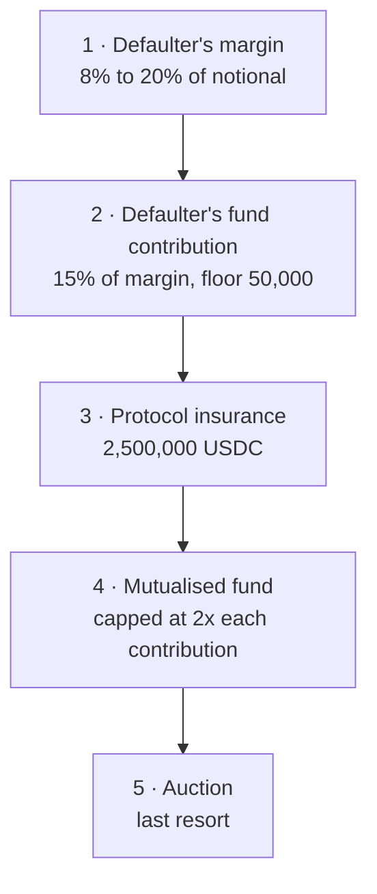

# Default waterfall

When a participant fails to meet an obligation, Spire Protocol does not race to sell its
position into the market. Loss is absorbed in a fixed order.

## The order

1. **Margin of the defaulting participant.** Their own collateral goes first.
2. **Their contribution to the default fund.** Still their own money.
3. **The protocol insurance layer.** Capital set aside by the protocol itself.
4. **The mutualised fund of the other members.** Only here does anyone else's money move.
5. **Auction.** The position is auctioned to other clearing members.

The order is fixed in advance. It is not a policy that can be adjusted during a stress
event, because a discretionary waterfall is not a waterfall.



Layers one to three are the defaulter's own money and the protocol's. Layer four
is the first one that touches anybody else's, and it is capped before they join.

## The layers, with numbers

| Layer | Source | Size at launch |
| --- | --- | --- |
| 1 | Defaulter's initial margin | 8% to 20% of its notional, by tier |
| 2 | Defaulter's default fund contribution | 15% of its required margin, floor 50,000 USDC |
| 3 | Protocol insurance | 2,500,000 USDC |
| 4 | Mutualised fund | Capped at 2x each member's contribution per event |
| 5 | Auction | The position itself |

Layer 4 is the only one that touches capital belonging to members who did nothing wrong,
and it is capped. That cap is the number a member should read before joining, because it is
the most that somebody else's failure can cost them in one event.

## Worked example

A tier 1 member carrying 10,000,000 of notional stops meeting margin calls, and the position
is 6% underwater by the time the cure period expires.

| Step | Amount | Running shortfall |
| --- | --- | --- |
| Loss to cover | 600,000 | 600,000 |
| Layer 1, its margin at 8% | 800,000 | 0 |

The default is absorbed at layer 1 and nothing else moves. No other member is touched, no
insurance is drawn, and no auction happens.

Now the same default in a gap, where the position is 14% underwater:

| Step | Amount | Running shortfall |
| --- | --- | --- |
| Loss to cover | 1,400,000 | 1,400,000 |
| Layer 1, margin | 800,000 | 600,000 |
| Layer 2, own fund contribution | 120,000 | 480,000 |
| Layer 3, protocol insurance | 480,000 | 0 |

Still nobody else's money. The mutualised layer is reached only when a single default
exhausts 2.5 million of protocol capital after the defaulter's own money is gone.

## The timeline

| Event | When |
| --- | --- |
| `free` goes negative | Margin call issued, `curesAt` set |
| Cure period | 600s |
| Default declared | Immediately after cure expires |
| Auction opens | 300s after default |
| Auction runs | 900s, Dutch |
| Replenishment of the fund | 5 days |

The 300 second gap between default and auction is deliberate. It is the window in which the
first three layers are applied, so that the auction is sized against what is actually left
uncovered rather than against the whole position.

## Why the order matters more than the size

The useful question for a participant is not "what if a position blows up". It is "how many
layers have to burn through before it reaches me". That number is knowable in advance, and
it is what lets a clearing member size its exposure without knowing who else is in the book.

## Liquidation as a last resort

Forced selling into a thin market turns one participant's failure into everybody's price
event. Putting the auction last means the market sees the position only after four layers
of capital have already failed to cover it.

The [concentration cap](collateral.md) exists for the same reason. A position that is large
enough to move the price of its own asset cannot be auctioned near its mark, so the protocol
refuses to let one accumulate in the first place.

## What the other side sees

Nothing. Obligations are independent from the moment of novation, so the member on the other
side of the defaulter's trade settles normally against Spire Protocol and is not told that a
default occurred. That is the whole purpose of putting a collateralised counterparty in the
middle.

## Run both examples

```bash
git clone https://github.com/spireproto/spire-core
node examples/default.js
```

Both defaults on this page are tests in that package, so if the published numbers
and the code ever drift apart the suite fails before the docs do.
