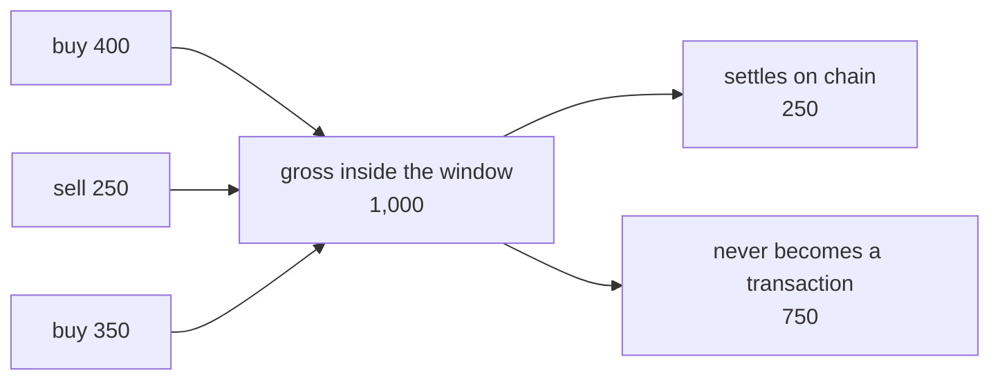

# Netting inside the settlement window

Obligations do not settle one by one. They accumulate inside a settlement window and
collapse against each other before anything reaches the chain.

## Worked example

A participant trades the same asset three times inside one window:

| # | Direction | Size |
|---|---|---|
| 1 | buy | 400 |
| 2 | sell | 250 |
| 3 | buy | 350 |

Gross flow across those obligations is `400 + 250 + 350 = 1000`.

The sell offsets part of the buys, so the position that has to be delivered is
`400 - 250 + 350 = 500`, and once the same collapse is applied on the funding side of the
book the amount that actually moves at the close of the window comes to `250`.

Same turnover. A quarter of the capital actually moved.



## Netting across venues

The example above is one member on one venue. The interesting case is the same member
trading the same asset in two places inside one window.

| Venue | Direction | Size |
| --- | --- | --- |
| A | buy | 600 |
| B | sell | 450 |

Bilaterally this is two open positions on two venues, each requiring its own margin and its
own settlement. After [novation](novation.md) both obligations face the same counterparty in
the same asset, so they are the same instrument and they net.

The member delivers 150. Neither venue learns that the other exists, and neither can see the
other side of the member's book.

## What margin is charged against

Margin follows the net, not the gross. This is where netting in time stops being an
efficiency and starts being the product.

| | Gross | Net |
| --- | --- | --- |
| Notional in the window | 1,000 | 250 |
| Initial margin at tier 1, 8% | 80 | 20 |

The member carries 20 of margin against a thousand of turnover. Under prefunding the same
turnover requires a thousand of assets sitting still.

## Why this is not just a saving on gas

Every unit of gross flow that reaches the chain is a unit of capital that has to exist, at
that moment, in the right place. Netting reduces the capital the market must hold to
support a given turnover. Gas is a rounding error next to that.

## Rules

- Netting is per member, per asset, per settlement window. Not per venue.
- Obligations from different venues net against each other, because after
  [novation](novation.md) they are the same instrument.
- Bought and sold inside the same window nets to zero. Nothing goes on chain.
- Nothing carries across a window boundary. A window is closed and settled on its own.
- An obligation is assigned to a window at novation and never moves to another one.

## The window, in numbers

| Phase | Length | What is possible |
| --- | --- | --- |
| Open | 300s | Fills accepted, obligations accumulate |
| Finalising | 30s | Nothing accepted, nets computed |
| Settling | 120s | Nets must be delivered |

```text
    [ open 300s ........ ][ finalising 30s ][ settling 120s ]
      fills accepted       nets computed     net delivered
```

A fill that arrives during finalisation is not rejected. It is assigned to the next window,
and the SDK retries it for you. The error code is `SPIRE-4001`, described in
[Errors](errors.md).

## The trade-off in window length

Shorter windows settle more often and net less. Longer windows net more and hold exposure
for longer before it is extinguished.

Five minutes is the launch value. It nets a busy member down by roughly the ratio in the
example above while keeping unsettled exposure inside the range that the margin rates in
[Parameters](parameters.md) are sized for.

## Check it against your own flow

```bash
git clone https://github.com/spireproto/spire-checks
node checks/netting.mjs my-fills.json
```

Compression is a property of flow, not of a protocol. Over 33 modelled days in
[netting-replay](https://github.com/spireproto/netting-replay) it ranges from
8.3% on the thinnest day to 47.8% on the busiest, so any single figure quoted
without the flow behind it is one to distrust, including ours.
