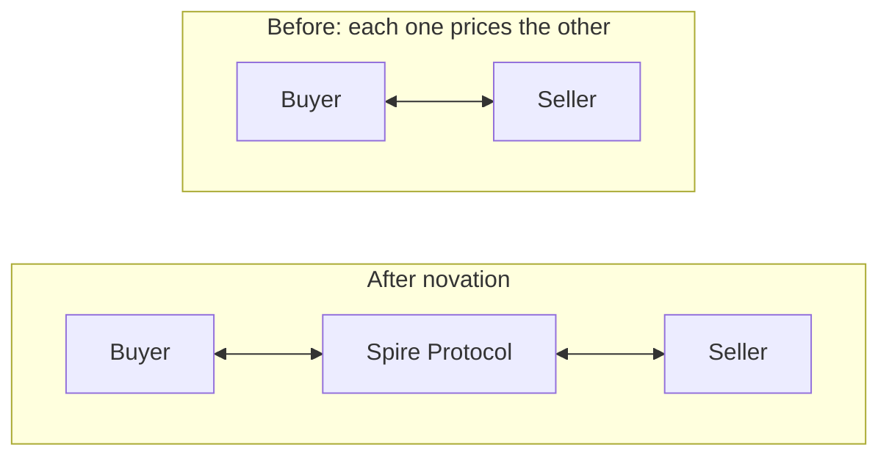

# Novation

Spire Protocol does not pass the trade along. It replaces it.

A matched trade between A and B is discharged and two new obligations are written in its
place: A owes Spire Protocol, and Spire Protocol owes B. The original bilateral link is gone.

## Why it matters

Before novation each participant has to answer a question about every counterparty it
touches: can this one pay. That question is expensive, it does not scale across venues, and
it is the reason bilateral markets stay small and clubby.

After novation the question is asked once, about one counterparty, and that counterparty is
collateralised and continuously provable.

> You are no longer trading with a stranger. You are trading with collateral.

## What happens in the call

One request from the venue, and four things happen before it returns.

| Step | Check | Failure |
| --- | --- | --- |
| 1 | Signature recovers to the venue key | `SPIRE-1002` |
| 2 | Asset is clearable | `SPIRE-1204` |
| 3 | Both members are onboarded and not in a call | `SPIRE-1205`, `SPIRE-3005` |
| 4 | Neither side breaches its limit or concentration cap | `SPIRE-3001`, `SPIRE-3003` |

Only after all four pass is the trade discharged and the obligations written. A fill that
fails any check is refused while it is still only a message. Nothing is unwound, because
nothing was created.

## One fill, two obligations

The two obligations are independent from the moment they exist.

| | Buyer side | Seller side |
| --- | --- | --- |
| Owes | The cash leg | The asset leg |
| Faces | Spire Protocol | Spire Protocol |
| Margin held against | Its own net | Its own net |
| Affected if the other defaults | No | No |

That last row is the entire product. See [Default waterfall](default-waterfall.md) for what
happens to the loss instead.

## Consequences

- **Anonymity between participants becomes safe.** Neither side needs to know who is on the
  other end, because neither side is exposed to the other.
- **Venues become interchangeable.** An obligation from venue X and an obligation from
  venue Y are the same instrument once novated, so they can net against each other. This is
  what makes cross-venue [netting](netting.md) possible at all.
- **Risk concentrates on purpose.** All exposure lands on one balance sheet. That is the
  point, and it is why the collateral rules and the waterfall are strict.

## What has to be true for it to work

1. The clearing entity is over-collateralised at all times, not on average. Checked every
   window and published as a [solvency proof](solvency.md).
2. Position limits bind before an obligation is accepted, not after. That is step 4 above.
3. The order of loss absorption is fixed in advance and not subject to discretion.

Fail any one of these and novation stops being risk transfer and becomes risk accumulation.
