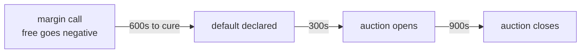

# Operations

Running against a clearing layer is not the same as running against a venue. The protocol
has clocks, and those clocks decide your paging policy.

## The clock that sets your on-call



The ten minutes before the default is declared is the whole budget: detection,
decision, and a confirmed transaction. Nothing after it is yours to influence.

`curesAt` is an absolute timestamp and it survives a window boundary. Ten minutes is the
whole budget: detection, decision, and a transaction confirmed on chain. If your alert
routing takes four of those minutes, you have six.

Page a human on `margin.call`. Do not batch it into a digest.

## What to monitor

| Signal | Source | Alert when | Severity |
| --- | --- | --- | --- |
| `free` collateral | `collateral.get` | Below 15% of `haircutValue` | Warn |
| `free` collateral | `collateral.get` | Negative | Page |
| `utilisation` | `positions.get` | Above 8000 bps | Warn |
| `utilisation` | `positions.get` | Above 9500 bps | Page |
| Margin call | `margin.call` event | Any | Page |
| Window state | `windows.current` | `settling` for more than 120s | Page |
| Novation errors | `SPIRE-3001` rate | Any sustained rate | Page |
| Novation errors | `SPIRE-4001` rate | Above 2% of fills | Warn |
| Clock drift | Your NTP | Above 20s from chain time | Warn |
| Websocket | Heartbeat | No frame for 40s | Warn, reconnect |
| Rate limit | `429` responses | Any | Warn |

Two of these deserve comment.

`SPIRE-3001` at any sustained rate means your matcher is not checking limits before it
matches. Users are being told a trade happened and then finding out it did not clear. Read
`positions.get` on the matching path.

`SPIRE-4001` above a couple of percent means your fills are clustering at the window
boundary. Harmless per fill, but it moves flow into the next window and changes the net you
were expecting.

## Reconciliation

Once per window, after `window.finalised`.

```js
clearing.on('window.finalised', async ({ windowId }) => {
  const positions = await clearing.positions.list({ windowId });
  for (const p of positions) {
    const local = ledger.netFor(p.member, p.asset, windowId);
    if (local !== p.net) alert('net mismatch', { member: p.member, local, theirs: p.net });
  }
});
```

A mismatch is almost always one of three things: a fill you sent and did not record, a fill
that landed in the next window because of `SPIRE-4001`, or a sub-account you are netting
separately while the protocol nets them together. Check in that order.

Do not reconcile against `gross`. Gross is informational; the number that has consequences
is `net`.

## Runbooks

### Margin call

1. Confirm `free` is actually negative through `collateral.get`, not only from the event.
2. Post collateral. This is faster than reducing, because reducing needs offsetting fills to
   be matched, novated and netted, and there may not be liquidity.
3. If you cannot post in time, reduce in the largest asset first. Concentration is what the
   auction punishes.
4. Confirm `free` is positive again before `curesAt`. The event does not fire twice.

### A window will not settle

`state` stuck at `settling` past the deadline means somebody has not delivered, and it may
be you.

1. Check your own net through `positions.list` and confirm delivery.
2. Check the settlement asset allowance on the settlement contract. `SPIRE-5003` is an
   allowance problem far more often than a balance problem.
3. If your side is delivered, nothing further is required of you. A counterparty failure is
   absorbed by the [waterfall](default-waterfall.md) and does not become your problem.

### Somebody else defaulted

Nothing. That is the answer, and it is the product.

Your obligations face Spire Protocol, not the defaulter, so they settle normally. You may
see an `Absorbed` event reaching layer four, which means the mutualised fund was touched and
you will be assessed up to twice your contribution. That assessment appears as a reduction
in your default fund balance, not as a margin call.

### Your venue was suspended

`SPIRE-2002` on every fill. Stop routing, do not retry, and contact operations. Existing
obligations are unaffected and settle normally, because suspension stops intake and touches
nothing that already exists.

### Clock drift

`SPIRE-1003` means `matchedAt` is more than 60 seconds from chain time. Fix NTP on the
matcher. Do not fix it by backdating `matchedAt`, which turns a monitoring problem into a
signature that will not verify.

## Capacity

| Limit | Value |
| --- | --- |
| Fills | 200 per second per venue |
| Reads | 50 per second per venue |
| Websocket connections | 8 per venue |

The fills limit is per venue, not per member, so a venue clearing for many users shares one
budget. If your matcher can burst above 200 per second, queue on your side rather than
discovering `429` during a volatile minute.

Reads are the limit people hit first, usually by polling `positions.get` per fill. Use the
websocket and poll only as a fallback.

## Before you go live

- Alert routing for `margin.call` reaches a human in under four minutes, tested.
- Limit check sits on the matching path, not on the settlement path.
- `SPIRE-4001` is retried once, verified by sending a fill during finalisation on testnet.
- Reconciliation runs every window and alerts on mismatch.
- NTP is monitored, not merely configured.
- Somebody who is not you can find this page at three in the morning.
