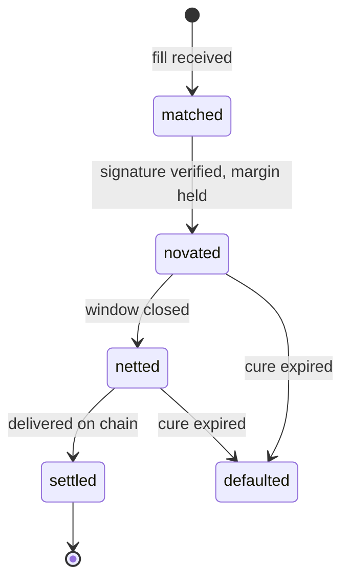

# Overview

A trade reaches Spire Protocol already matched. Price discovery happened somewhere else and
we do not touch it. What we take over is everything between the match and final settlement.

## Lifecycle of an obligation

1. **Fill.** A venue posts a matched fill, signed, referencing both participants and the
   asset. Nothing has moved yet.
2. **Novation.** The trade is torn up and re-signed against Spire Protocol. The buyer owes
   Spire Protocol, and Spire Protocol owes the seller. Two obligations replace one trade.
3. **Limit check.** Each obligation is checked against the participant's position limit,
   which is a function of the collateral they have staked.
4. **Netting.** Inside the settlement window, obligations in the same asset collapse
   against each other.
5. **Settlement.** At the close of the window the net difference settles on chain. What
   netted out never becomes a transaction.
6. **Default, if it happens.** The obligation does not disappear. It is covered by the
   waterfall, in order, and the counterparty on the other side is paid.

Steps 1 to 3 take one call. Steps 4 and 5 happen on the window clock without the venue
doing anything. See [Quickstart](quickstart.md).

## The same lifecycle in one line

`defaulted` branches off `novated` and `netted`. Nothing else is reachable, and no state is
ever revisited. Field-level detail is in [Data model](data-model.md).

## Where the writes happen

This is the part that decides whether a clearing layer is worth having.

| Event | Chain writes |
| --- | --- |
| A fill is novated | none |
| A thousand fills are novated | none |
| A window closes | one per member per asset, against the net |
| A member defaults | one, plus the auction if it gets that far |

A venue doing ten thousand fills an hour in one asset for one member writes to the chain
twelve times, once per five minute window, and each write carries only the difference.

## What the venue keeps and what it hands over

| Stays with the venue | Moves to Spire Protocol |
|---|---|
| Price discovery, matching, the order book | Counterparty risk |
| The user relationship | Collateral management |
| Fee policy on its own side | Netting and settlement timing |
| Listing decisions | Default handling |

## What this is not

- Not a venue. We do not quote, match or route.
- Not a custodian of the venue's users.
- Not a lending market. Collateral secures obligations, it is not lent out.
- Not a bridge. The clearing layer is native to Robinhood Chain and does not run a second
  deployment on another chain.

## Reading order

If you are deciding whether this is useful, read [Novation](novation.md) and then
[Netting](netting.md). Those two carry the argument.

If you are deciding whether it is safe, read [Collateral](collateral.md),
[Default waterfall](default-waterfall.md) and [Parameters](parameters.md). The third one is
where the claims turn into numbers.

If you are integrating, go to [Quickstart](quickstart.md) and keep
[API reference](api-reference.md) and [Errors](errors.md) open beside it.

If you want to check the claims yourself rather than read about them, go straight to
[Contracts](contracts.md). Every number on this site is a view call away.

If you are already live and somebody is on call, [Operations](operations.md) is the page
that should be open at three in the morning.

## Running any of this

The arithmetic on these pages is a package with tests:
[spire-core](https://github.com/spireproto/spire-core). The on-chain surface is
[spire-contracts](https://github.com/spireproto/spire-contracts), the client is
[spire-sdk](https://github.com/spireproto/spire-sdk), and everything the docs
claim about the chain can be re-measured with
[spire-checks](https://github.com/spireproto/spire-checks).
